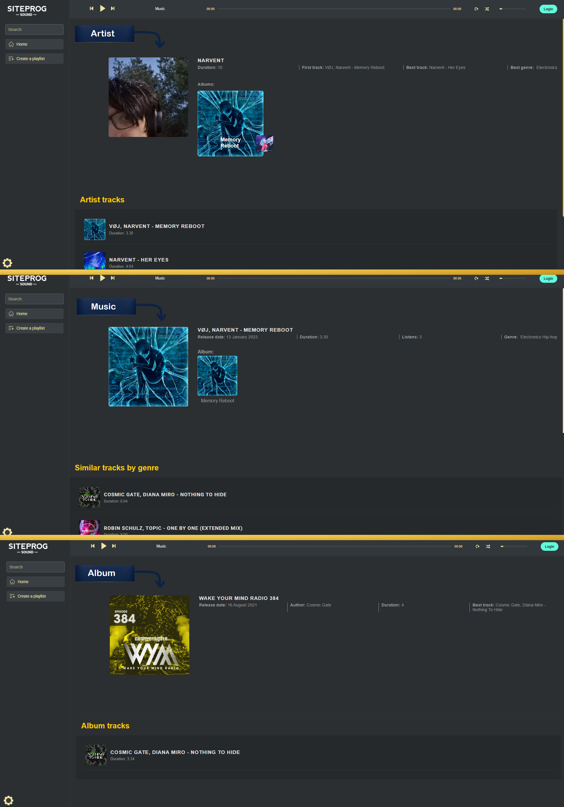
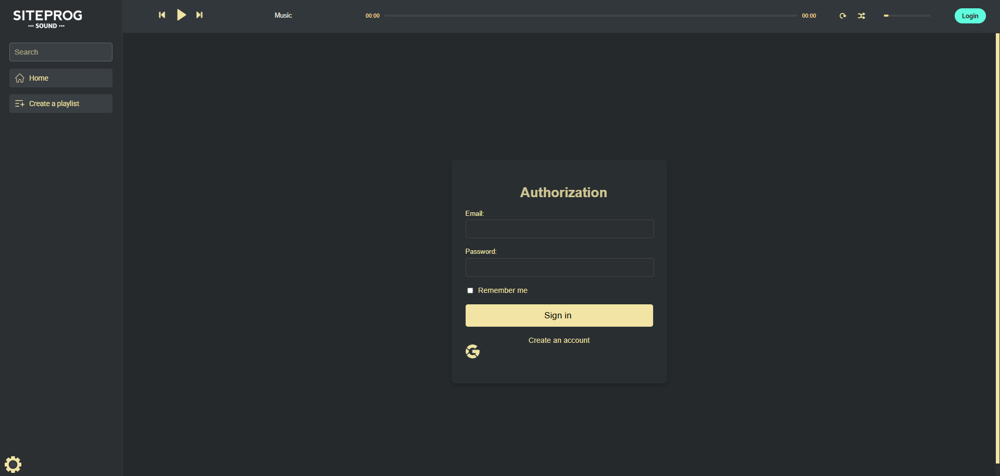
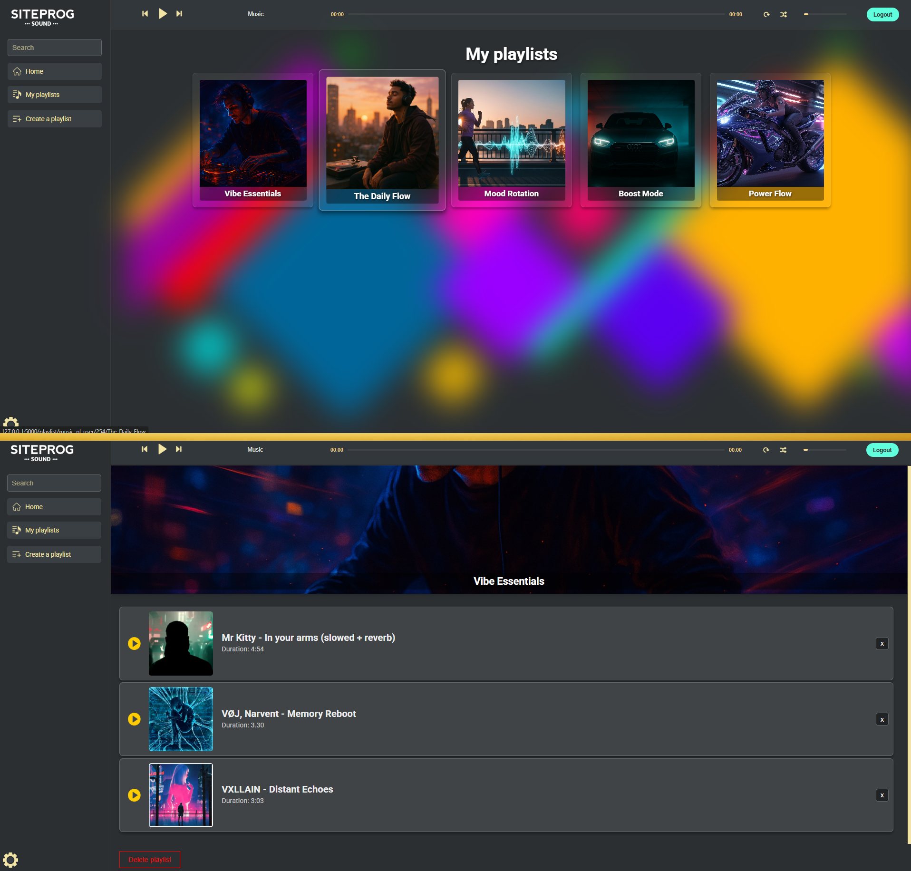
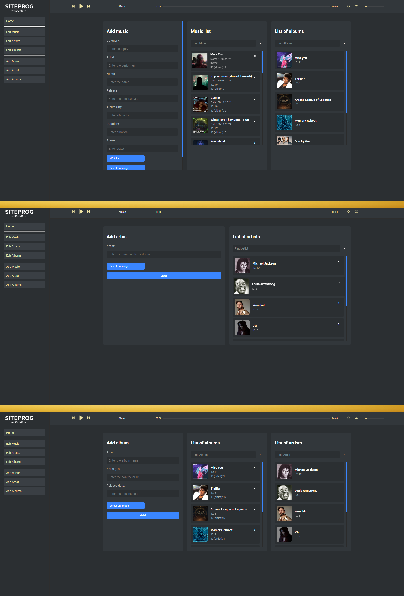
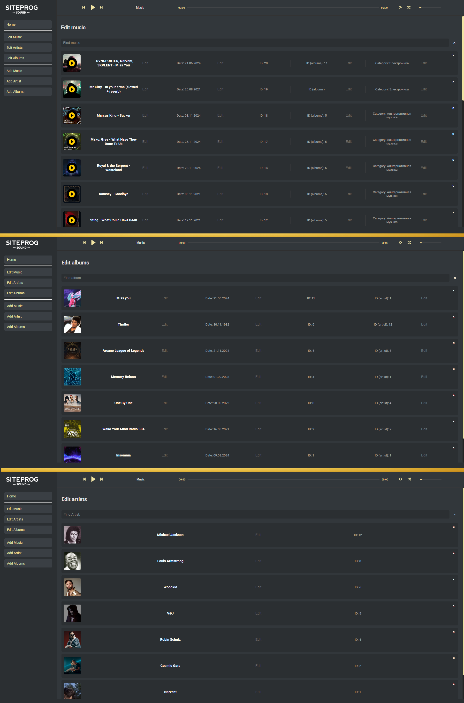

# MUSIC STREAMING WEB SERVICE

**SiteProgSound** is a web application for streaming and managing music content. The platform offers intuitive music consumption, playlist creation, and role-based administration. Built with Flask (Python) and REST API, it provides a modern, user-friendly interface and full content management capabilities.

---

## Table of Contents
- [Overview](#overview-)
- [Core Features](#core-features-)
- [Technologies](#technologies-)
- [List of Available Website Pages](#list-of-available-website-pages-)
  - [Home Page](#home-page)
  - [Music & Artist & Album](#music--artist--album-)
  - [Account](#account-)
  - [Menu Section](#menu-section-)
  - [Playlists Section](#playlists-section-)
  - [Admin Panel Features](#admin-panel-features-)
- [Architecture of the System](#architecture-of-the-system-)
- [How to Run the Project](#how-to-run-the-project-)
- [Author](#author-)

---

## Overview
**SiteProgSound** is an intuitive web application that allows users to:
- Browse music efficiently with fast search and filtering
- Stream music in real-time with playback controls
- Create, edit, and manage personal playlists
- Enjoy a responsive and animated UI
- Use multilingual interface

The platform also includes an admin panel for managing music, albums, and artists.

---

## Core Features [⬆](#table-of-contents "Back to Top")

### User Interface
- Adaptive Home Page with personalized blocks:
  - Tags
  - Artists
  - Albums
  - Random music selections
- Music, Artist, and Album Pages: Show recommendations and related content
- Menu Section: Fixed navigation menu for quick access to playlists, search, and music content
- Responsive and Animated UI: JSON-powered animations for interactive elements

### User Functionality
- Registration and Authentication: Sign up, login, auto-login, logout
- Playlists: Create, edit, delete, and manage playlists with cover art and track list
- Search Functionality: Search by track, artist, or album with caching for faster performance
- Language Switching
- Playback Controls: Play, pause, skip, repeat, shuffle

### Admin Panel
- Add Content:
  - Add Music
  - Add Album
  - Add Artist
  - Auxiliary search lists for fast selection
- Edit Content:
  - Edit Music
  - Edit Album
  - Edit Artist
  - Modify all key parameters through user-friendly forms
- Role-Based Access: Separate interface for administrators and end users

---

## Technologies [⬆](#table-of-contents "Back to Top")
- **Backend:** Python, Flask, REST API
- **Frontend:** HTML5, CSS3, JavaScript
- **Database:** SQLite
- **Additional:** JSON animations, localization, session-based caching

Next, I will demonstrate the detailed structure of the project and showcase  
screenshots of the web application.

---

## List of Available Website Pages [⬆](#table-of-contents "Back to Top")

### Home Page
The main page consists of blocks such as interesting tags, artists, albums, and random music. This creates a visually appealing structure and provides convenient navigation, allowing users to easily discover new music.


<p align="center"><small><small><em>Image of the “Home” page</em></small></small></p>

---

### Music & Artist & Album [⬆](#table-of-contents "Back to Top")
By navigating from the main page to the “Music,” “Albums,” or “Artists” sections, users receive additional information and recommendations for similar content, which helps them discover new music.


<p align="center"><small><small><em>Image of the pages “Add music,” “Add artist,” and “Add album” 
 </em></small></small></p>

---

### Account [⬆](#table-of-contents "Back to Top")
A dynamic page with the option to register a new account or log in to an existing one — for personalized access, saving playlists, and managing music preferences.


<p align="center"><small><small><em>Image of the “Login” pages
 </em></small></small></p>

---

### Menu Section [⬆](#table-of-contents "Back to Top")
A fixed navigation menu that is always available to users thanks to the site's layout, providing quick access to creating and viewing playlists, as well as convenient search for music, albums, and artists.

<p align="center">
  
</p>
<p align="center"><small><small><em>Image of menu options 
 </em></small></small></p>

---

### Playlists Section [⬆](#table-of-contents "Back to Top")
A page where you can view all user playlists and see detailed information about each one, including the cover art, title, and track list. Interactive editing is available: when you click on the title or image, you can change the cover art, rename the playlist, or delete it completely.


<p align="center"><small><small><em>Image of the “Playlists” and “Playlist (name)” pages
</em></small></small></p>

---

### Admin Panel Features [⬆](#table-of-contents "Back to Top")

#### Add Data
The administrator has access to pages for adding content: “Add Music,” “Add Album,” and “Add Artist.” Functional and user-friendly input forms have been implemented, and auxiliary search lists have been integrated for quick selection of artists, albums, and other related data, which greatly simplifies the process of filling the service with content.


<p align="center"><small><small><em>Image of the pages “Add music,” “Add artist,” and “Add album” 
</em></small></small></p>

#### Edit Data
The “Edit Content” section. The administrator has access to editing pages such as “Edit Music,” “Edit Album,” and others. Functional and conveniently designed forms are implemented with the ability to change all key parameters.


<p align="center"><small><small><em>Pages “Edit Music,” “Edit Artist,” and “Edit Album.”
</em></small></small></p>

---

## Architecture of the System [⬆](#table-of-contents "Back to Top")

### Project Architecture Overview

SiteProgSound is built using a modular architecture with Flask.
Key components include:
- `app_sps/` — core app with modules: auth, admin, content, playlist
- `auth/`, `admin/`, `content/`, `playlist/` — contain routes, DB logic, services, and templates
- `static/`, `templates/` — frontend assets and global templates
- `locales/` — multilingual content (English/Russian)
- `logs/` — logging configuration and log files
- `siteprogsound.db` — main SQLite database
- `run.py` — entry point to launch the web app

```bash
SiteProgSound/
│
├── app_sps/                          # Main application package
│   ├── __init__.py                   # App initialization
│   ├── extensions.py                 # Loads user/admin from session for Flask-Login
│
│   ├── admin/                        # Admin module
│   │   ├── __init__.py
│   │   ├── routes.py                 # Admin routes
│   │   ├── database/                 # DB logic for admin
│   │   │   ├── __init__.py
│   │   │   └── database.py
│   │   ├── models/                   # Admin + data models
│   │   │   ├── admin_models/
│   │   │   │   ├── __init__.py
│   │   │   │   └── models.py
│   │   │   └── data_models/
│   │   │       ├── __init__.py
│   │   │       └── models.py
│   │   ├── services/                 # Business logic for admin
│   │   │   ├── __init__.py
│   │   │   └── services.py
│   │   ├── src/                      # Admin-specific logic
│   │   │   ├── admin_login/
│   │   │   │   ├── __init__.py
│   │   │   │   └── admin_login.py
│   │   │   └── utils/
│   │   │       ├── __init__.py
│   │   │       └── utils.py
│   │   └── templates/                # Admin templates
│
│   ├── auth/                         # Authentication module
│   │   ├── __init__.py
│   │   ├── routes.py                 # Auth routes (login, register)
│   │   ├── database/
│   │   │   ├── __init__.py
│   │   │   └── database.py
│   │   ├── models/
│   │   │   ├── __init__.py
│   │   │   └── models.py
│   │   ├── services/
│   │   │   ├── __init__.py
│   │   │   └── services.py
│   │   ├── src/
│   │   │   ├── login_form/
│   │   │   │   ├── __init__.py
│   │   │   │   └── login_form.py
│   │   │   ├── user_login/
│   │   │   │   ├── __init__.py
│   │   │   │   └── user_login.py
│   │   │   └── utils/
│   │   │       ├── __init__.py
│   │   │       └── utils.py
│   │   └── templates/                # Auth templates
│
│   ├── content/                      # General content module
│   │   ├── __init__.py
│   │   ├── routes.py                 # Content-related routes
│   │   ├── database/
│   │   │   ├── __init__.py
│   │   │   └── database.py
│   │   ├── models/
│   │   │   ├── __init__.py
│   │   │   └── models.py
│   │   ├── services/
│   │   │   ├── __init__.py
│   │   │   └── services.py
│   │   ├── src/
│   │   │   ├── cache/
│   │   │   │   ├── __init__.py
│   │   │   │   └── cache.py
│   │   │   └── utils/
│   │   │       ├── __init__.py
│   │   │       └── utils.py
│   │   └── templates/                # Content templates
│
│   ├── playlist/                     # Playlist-related functionality
│   │   ├── __init__.py
│   │   ├── routes.py
│   │   ├── database/
│   │   │   ├── __init__.py
│   │   │   └── database.py
│   │   ├── models/
│   │   │   ├── __init__.py
│   │   │   └── models.py
│   │   ├── services/
│   │   │   ├── __init__.py
│   │   │   └── services.py
│   │   └── src/
│   │       ├── __init__.py          # Core playlist logic
│   │   └── templates/               # Playlist templates
│
│   ├── static/                       # Static assets
│   │   ├── Animations_json/         # Lottie-style animations
│   │   ├── css/
│   │   ├── images/
│   │   └── js/
│
│   ├── templates/                   # Global HTML templates
│   │   ├── error.html
│   │   ├── index.html
│   │   └── index_admin.html
│
│   ├── locales/                    # Localization content
│   │   ├── __init__.py
│   │   ├── content_en.json
│   │   ├── content_ru.json
│   │   └── load_language.py
│
│   ├── logs/                        # Logging system
│   │   ├── logs/
│   │   │   ├── combined.log
│   │   │   ├── error.log
│   │   │   └── request.log
│   │   ├── __init__.py
│   │   └── logclass.py
│
├── siteprogsound.db                 # Main SQLite database
├── .env                             # Environment variables
├── .gitignore                       # Git ignore file
├── config.py                        # Global configuration
├── database.py                      # Shared database init 
├── README.md                        # Project documentation
├── requirements.txt                 # Project dependencies
└── run.py                           # App entry point
```


## How to Run the Project [⬆](#table-of-contents "Back to Top")

**<span style="color: orange;">•</span>&nbsp;&nbsp;Environment Variables / .env:**

This project uses a `.env` file to store configuration and sensitive information.  
Before running the project, make sure you have a `.env` file in the root directory with the following variables:


<ul>
  <li><span style="color: orange;">SECRET_KEY</span> = your-secret-key-here</li>
  <li><span style="color: orange;">GOOGLE_CLIENT_ID</span> = your-google-client-id</li>
  <li><span style="color: orange;">GOOGLE_CLIENT_SECRET</span> = your-google-client-secret</li>
  <li><span style="color: orange;">GOOGLE_DISCOVERY_URL</span> = https://accounts.google.com/.well-known/openid-configuration</li>
</ul>

> Replace `your_secret_key` with a strong random string.  
> If you’re missing the `.env` file, the application **will not start**.

**<span style="color: orange;">•</span>&nbsp;&nbsp;Create and activate a virtual environment:**
```bash
  python -m venv venv
  source venv/bin/activate      # for Linux/macOS
  venv\Scripts\activate         # for Windows
  ```

**<span style="color: orange;">•</span>&nbsp;&nbsp;Install dependencies:**
```bash
  pip install -r requirements.txt
  ```

**<span style="color: orange;">•</span>&nbsp;&nbsp;Run the application:**
```bash
  python run.py
 ```

**<span style="color: orange;">•</span>&nbsp;&nbsp;Open in your browser:**

```bash
  http://127.0.0.1:5000
```

---

## Author [⬆](#table-of-contents "Back to Top")

**Denys Ilkovych**  
Developer and initiator of the **PricePredictor** project.

